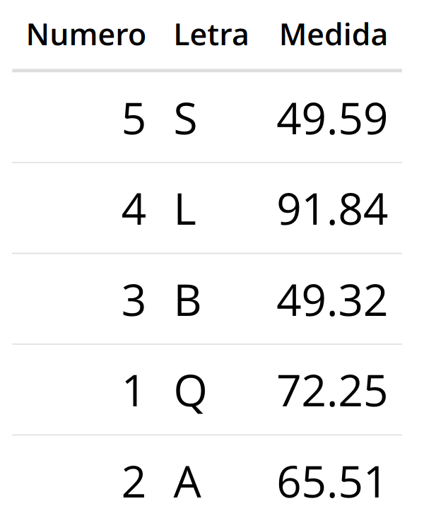

```{=html}
<!-- # El tidyverso {#tidy}

En esta clase empezaremos a trabajar en r, puedes seguir la presentación en el siguiente [link](https://derek-corcoran-barrios.github.io/CursoProgrPres/Clase1/Clase1TidyData.html), y a continuación tienes el link de la clase online en youtube:

<iframe width="560" height="315" src="https://www.youtube.com/embed/pr6dMwtto0w" frameborder="0" allow="accelerometer; autoplay; clipboard-write; encrypted-media; gyroscope; picture-in-picture" allowfullscreen></iframe>
-->
```
# Introducción

R es un entorno y lenguaje de programación con un enfoque al análisis
estadístico. Permite hacer todos los análisis numéricos que requieras en
tu vida profesional. Es una implementación de libre distribución de otro
programa estadístico de uso comercial, S. Al ser software libre, es la
comunidad de usuarios la que guía su desarrollo, transformándolo en uno
de los programas más versátiles para trabajos cuantitativos existentes
hoy en día. La página principal desde la que se puede acceder a los
archivos y documentación necesarias para su utilización es:

[www.r-project.org](http://www.r-project.org)

Si bien R es un software que puede usarse desde la línea de comando,
para trabajar utilizaremos [http://www.rstudio.org](%60R%20Studio%60).

Este es un Entorno de Desarrollo Integrado (IDE, por su sigla en inglés)
que, al igual que R, es software libre y permite integrar herramientas
necesarias para el desarrollo y así facilitarlo. La página oficial para
descargarlo es:

[www.rstudio.com](http://www.rstudio.com)

## Objetos

En términos genéricos, todos los elementos que R maneja son objetos. Un
objeto tiene ciertas propiedades y en ocasiones es capaz de llevar a
cabo ciertas tareas si se le dan los argumentos necesarios. Por ejemplo,
un teléfono es capaz de realizar llamadas siempre que le demos el número
a marcar.

## Variables

Al momento de trabajar, es probable que necesitemos guardar valores o
cálculos, de manera que no necesitemos escribirlos cada vez que los
usemos, para esto utilizamos variables.

Para realizar una asignación de variable:

```{r }
a = 200
```

Luego, podemos utilizar el valor contenido en la variable, utilizando su
nombre:

```{r }
print(a)
```

### Tipos de variables

Existen diversos tipos o clases de variables, dependiendo de las
características del objeto que les es asignado. Para conocer a qué tipo
corresponde un objeto usamos class:

```{r}
x=7
x
class (x)
```

```{r}
x=5/3
x
class (x)
```

```{r}
x="Trece"
x
class (x)
```

## Funciones

Muchas cosas en R pueden hacerse a través del uso de funciones, estas
permiten realizar operaciones típicas sin necesidad de escribir grandes
cantidades de código. Por ejemplo:

```{r}
sqrt(10)
round(1.9)
seq(0,10)
seq(0,10,2)
rep(5,10)
paste(seq(5,10), "elefantes")
```

Los datos o variables que van dentro de las funciones, se denominan
*argumentos* y cada función requiere que se le entreguen los argumentos
apropiados para ejecutar la acción prevista.

Por ejemplo, la función mean() no puede calcular el promedio si como
argumentos se le pasan letras.

```{r}
mean(c("a","b","c"))
```

Esto es importante, porque al introducir datos podemos estar utilizando
números como palabras:

1, 2, 3 ≠ "1", "2", "3"

Si nos encontramos con este problema, debemos transformar los datos al
tipo o clase adecuada, con las funciones:

`as.numeric()` y `as. character()`x\`

## Vectores

Conjunto ordenado de valores del mismo tipo, agrupados en un único
objeto. Para crear una variable vector utilizamos:

```{r}
v = c(1,1,2,3)
vector = c("mi", "primer", "vector")
vector
```

Cada objeto dentro de un vector posee un índice, el cual indica la
posición que ocupa dentro del vector, para acceder a una posición
específica usamos:

```{r}
vector[1]
vector[2]
vector[3] 
```

y si queremos reemplazar alguno de esos objetos:

```{r}
vector[2]="segundo"
vector
```

Un vector permite almacenar varios valores en una única variable y
permite ejecutar operaciones o funciones a un conjunto de datos:

```{r}
vector = c(1,2,3,4,5)
vector*2
vector^2
```

o incluso realizar operaciones entre vectores:

```{r}
v1=c(1:3)
v2=c(6,8,10)
```

```{r}
v1
v2
```

```{r}
v1 + v2
```

```{r}
v1*v2
```

```{r error=TRUE, echo = T, results = 'hide'}
v3=c("a","b","c")
v1 * v3
```


## Instalar librerías

Muchas veces las funciones incorporadas en R son insuficientes para
nuestros fines, por lo que es necesario instalar paquetes o "packages"
de herramientas hechas por la comunidad. En este caso, usaremos el
paquete "openxlsx", que nos permite leer archivos Excel. Para
instalarlo:

```{r eval=FALSE}
install.packages("openxlsx")
```

Debe hacerse una única vez, los paquetes quedan instalados en nuestra
versión de R. Y para usarlo dentro de nuestro proyecto:

```{r eval=FALSE}
library(openxlsx)
```

Debe incluirse en cada proyecto donde queramos usarlo y ejecutarse cada
vez que abrimos R.

## R Notebook

Un Notebook en R es un documento con bloques o "chunks" que pueden ser
ejecutados directa e interactivamente, para así visualizar los
resultados directamente bajo el código.

Para instalar esta librería:

```{r eval=FALSE}
install.packages("rmarkdown")
```

Una vez instalada, puedes crear un nuevo notebook en RStudio llendo a
*File -\> new file -\> R notebook*.

Agrega un nuevo chunk haciendo click en el botón *Insert Chunk* en la
barra de herramientas o presionando *Ctrl+Alt+I*

Un chunk puede ser ejecutado usando:

1.  Haciendo click en el triángulo verde o "Run Current Chunk" en la
    esquina superior derecha de cada chunk.

2.  Clickeando al interior de un chunk y presionando *Ctrl + Enter*.

De ambas formas se ejecutará todo el código contenido dentro de el
chunk.

Cuando guardas ul notebook, un archivo HTML que contiene el código y los
resultados se guardará junto a él (Click en el botón de *Preview* o
presiona *Ctrl+Shift+K* para previsualizar el archivo HMTL)

## Leer datos

Delimitados por coma: read_csv("file.csv")

Con cualquier delimitador: read_delim("file.txt", delim = "\|")


## Ejercicios


1. Cree una nueva variable que contenga un vector con 10 números aleatorios
2. multiplíquela por seis.
3. cree una segunda variable que contenga una secuencia de 5 caracteres
4. combine las dos variable en una sola variable
5. ¿cuál es el largo de esta última variable creada?
6. ¿de qué tipo es esta variable?
7. ¿qué sucede si divie esta última variable por 3?
8. cree un vector con los elementos 1 2 3 4 5 6 y llámelo `x`
9. cree un nuevo vector con los elementos 10 20 30 40 50 y llámelo `y`
10. ¿qué ocurre si intenta sumar `x` e `y`? explique
11. agregue el valor 60 al vector `y` (hint: you can use the c() function)
12. sume `x` e `y`
13. multiplique `x` e `y`
14. cree un `data.frame`  con el mímimo código posible usando los datos de la siguiente imagen y llámelo `z`:

```{r echo=FALSE}

```

