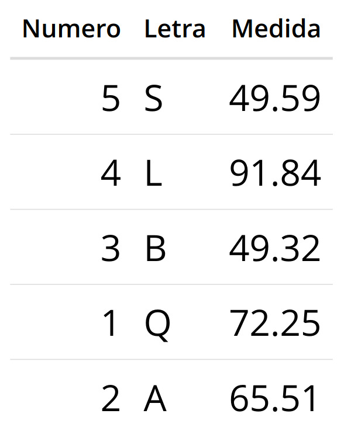

# Datos del curso

-   **Universidad Austral de Chile:** [Laboratorio de Ecoinformatica](http://www.ecoinformatica.cl)
-   **Nombre asignatura:** Introducción al Análisis de Datos Geoespaciales
-   **Código asignatuta:** CBIT200
-   **Docente responsable:** Horacio Samaniego
-   **Correo electrónico:** [horaciosamaniego\@uach.cl](mailto:horaciosamaniego@uach.cl){.email}
-   **Creadores:** [Derek Corcoran B.](https://derek-corcoran-barrios.github.io/) & Giorgia Graells C.
-   **Modalidad de clases:**
    -   Prácticas
    -   Presenciales
    -   Consultas por [Discord](https://discord.gg/TWGvq53tm) (chat o video) -- link válido hasta 9/9/2023
-   **Horario de clases:** Jueves 10:00 - 13:00 hrs
-   **Lugar:** Sala de computación, Facultad de Ciencias Forestales y Recursos Naturales, Campus Isla Teja, Valdivia
-   **Inicio clases:** 10 agosto 2023
-   **Término clases:** 30 noviembre 2023 (puede modificarse según calendario académico)
-   **Web del curso** [aqui](https://cbit200-programacion-geoespacial.github.io/)

## DESCRIPCIÓN DEL CURSO

Este curso tiene como objetivo central adquirir herramientas para el manejo de datos con un énfasis en datos espaciales para el menejo de los recursos naturales y la aproximación y resolución de problemas ambientaleslos. Se busca la creación de competencias en los principios de investigación reproducible, representación y análisis de información espacial y la creación de mapas estáticos e interactivos. Esto permitirá la adquisiciónde herramientas para profundizar el conocimientos acerca del diseño y desarrollo de análisis de datos ambientales complejos y espacialmente explícitos.

### OBJETIVOS

1.  Conocer y entender el concepto de Investigación Reproducible como una forma y filosofía de trabajo que permite que las investigaciones sean más ordenadas y replicables, desde la toma de datos hasta la escritura de resultados utilizando R

2.  Realizar análisis críticos de la naturaleza de los datos al realizar análisis exploratorios y reforzar conociminetos en estadística

3.  Realizar análisis de datos espaciales, poder hacer mapas y aplicar a preguntas de conservación y manejo de recursos naturales.

4.  Aprender a utilizar de forma proficiente el lenguaje de programación R y la plataforma GitHub en un ambiente de trabajo colaborativo.

## Evaluación

### tareas
-   Se entregarán ejercicios que deben resolverse semanales. La entrega se hará usando la plataforma GitHub. Cada estudiante será responsable de entregar su tarea y de corregir a tres compañeros al azar. Las correcciones ocurrirán en modalidad "doble ciego", es decir, tanto el corrector como el autor de la tarea serán mantenido como anónimo. Esta modalidad de corrección por pares será moderada por el profesor y seguirá una pauta entregada para cada tarea. Los estudiantes recibirán un punto por cada tarea revisada, lo que se sumará para completar el puntaje de su propia tarea. 

### proyecto
-   Se desarrollá un proyecto de análisis y de programación que será desarrollado durante el último mes de clases y presentado en las últimas dos sesiones del curso.

### calificaciones
```{=html}
<style type="text/css">
  .calificaciones {width: 35%; left: 50%}
</style>
```
::: calificaciones
| *Evaluación*               | *Ponderación* |
|----------------------------|---------------|
| Ejercicios \& Tareas  $$\frac{1}{n}\sum_i^n nota\, tarea_i$$       | 50%           |
| Proyecto reporte           | 10%           |
| Proyecto código            | 20%           |
| Presentación               | 15%           |
| Participación / Asistencia | 5%            |
:::

## Calendario

+------------+---------------+-------------------------------------------------------------+
| Semana     | Fecha         | Actividad                                                   |
+============+===============+=============================================================+
| 1          | 10 Agosto     | -   Presentación del curso                                  |
|            |               |                                                             |
|            |               | -   Procedimientos y reglas de evaluación.                  |
|            |               |                                                             |
|            |               | -   R, sus variables, objetos y funciones                   |
+------------+---------------+-------------------------------------------------------------+
| 2          | 17 Agosto     | -   Introducción a GitHub;                                  |
|            |               |                                                             |
|            |               | -   Investigación reproducible                              |
+------------+---------------+-------------------------------------------------------------+
| 3          | 24 Agosto     | Markdown y Rmd avanzado                                     |
+------------+---------------+-------------------------------------------------------------+
| 4          | 31 Agosto     | Visualización I                                             |
|            |               |                                                             |
|            |               | -   ggplot2                                                 |
|            |               |                                                             |
|            |               | -   otras librerías                                         |
+------------+---------------+-------------------------------------------------------------+
| 5          | 7 Septiembre  | Correlación y Regresión                                     |
+------------+---------------+-------------------------------------------------------------+
| 6          | 14 Septiembre | Intorducción a R como un Sistemas de Información Geográfica |
+------------+---------------+-------------------------------------------------------------+
| 7          | 21 Septiembre | Rasters                                                     |
+------------+---------------+-------------------------------------------------------------+
| 8          | 28 Septiembre | Modelos en rasters                                          |
+------------+---------------+-------------------------------------------------------------+
| 9          | 5 Octubre     | Autocorrelación espacial                                    |
+------------+---------------+-------------------------------------------------------------+
| 10         | 12 Octubre    | Visualización II (mapas)                                    |
+------------+---------------+-------------------------------------------------------------+
| 11         | 19 Octubre    | Visualización III (interactiva)                             |
+------------+---------------+-------------------------------------------------------------+
| 12         | 26 Octubre    | Sensores Remotos                                            |
+------------+---------------+-------------------------------------------------------------+
| 13         | 2 Noviembre   | Proyecto - Definición de Objetivos                          |
+------------+---------------+-------------------------------------------------------------+
| 14         | 9 Noviembre   | Proyecto - Modelo de Estudio e hipótesis de trabajo         |
+------------+---------------+-------------------------------------------------------------+
| 15         | 16 Noviembre  | Proyecto - Resultados                                       |
+------------+---------------+-------------------------------------------------------------+
| 16         | 23 Noviembre  | Proyecto - Presentación de Proyectos                        |
+------------+---------------+-------------------------------------------------------------+
| 17         | 30 Noviembre  | Epílogo & Presentación de Proyectos                         |
+------------+---------------+-------------------------------------------------------------+


## Recursos adicionales

Si bien intentamos buscar ejemplos originales y sets de datos locales, gran parte del material con que trabajaremos ha sido ya 
trabajado  elaborado por otros. Es por eso que se sugiere revisar algunos sitios claves como los siguientes:

- [R for Data Sciences](https://r4ds.hadley.nz)
- [Stackoverflow](https://stackoverflow.com/)
- [GIS Stack Exchange] (https://gis.stackexchange.com/)
- [Spatial Data Science] (https://rspatial.org/index.html)


<!--chapter:end:index.Rmd-->

---
title: "Introduccion al Analisis de Datos Geoespaciales"
editor_options: 
  markdown: 
    wrap: 72
---

```{=html}
<!-- # El tidyverso {#tidy}

En esta clase empezaremos a trabajar en r, puedes seguir la presentación en el siguiente [link](https://derek-corcoran-barrios.github.io/CursoProgrPres/Clase1/Clase1TidyData.html), y a continuación tienes el link de la clase online en youtube:

<iframe width="560" height="315" src="https://www.youtube.com/embed/pr6dMwtto0w" frameborder="0" allow="accelerometer; autoplay; clipboard-write; encrypted-media; gyroscope; picture-in-picture" allowfullscreen></iframe>
-->
```
# Introducción

R es un entorno y lenguaje de programación con un enfoque al análisis
estadístico. Permite hacer todos los análisis numéricos que requieras en
tu vida profesional. Es una implementación de libre distribución de otro
programa estadístico de uso comercial, S. Al ser software libre, es la
comunidad de usuarios la que guía su desarrollo, transformándolo en uno
de los programas más versátiles para trabajos cuantitativos existentes
hoy en día. La página principal desde la que se puede acceder a los
archivos y documentación necesarias para su utilización es:

[www.r-project.org](http://www.r-project.org)

Si bien R es un software que puede usarse desde la línea de comando,
para trabajar utilizaremos [http://www.rstudio.org](%60R%20Studio%60).

Este es un Entorno de Desarrollo Integrado (IDE, por su sigla en inglés)
que, al igual que R, es software libre y permite integrar herramientas
necesarias para el desarrollo y así facilitarlo. La página oficial para
descargarlo es:

[www.rstudio.com](http://www.rstudio.com)

## Objetos

En términos genéricos, todos los elementos que R maneja son objetos. Un
objeto tiene ciertas propiedades y en ocasiones es capaz de llevar a
cabo ciertas tareas si se le dan los argumentos necesarios. Por ejemplo,
un teléfono es capaz de realizar llamadas siempre que le demos el número
a marcar.

## Variables

Al momento de trabajar, es probable que necesitemos guardar valores o
cálculos, de manera que no necesitemos escribirlos cada vez que los
usemos, para esto utilizamos variables.

Para realizar una asignación de variable:

```{r }
a = 200
```

Luego, podemos utilizar el valor contenido en la variable, utilizando su
nombre:

```{r }
print(a)
```

### Tipos de variables

Existen diversos tipos o clases de variables, dependiendo de las
características del objeto que les es asignado. Para conocer a qué tipo
corresponde un objeto usamos class:

```{r}
x=7
x
class (x)
```

```{r}
x=5/3
x
class (x)
```

```{r}
x="Trece"
x
class (x)
```

## Funciones

Muchas cosas en R pueden hacerse a través del uso de funciones, estas
permiten realizar operaciones típicas sin necesidad de escribir grandes
cantidades de código. Por ejemplo:

```{r}
sqrt(10)
round(1.9)
seq(0,10)
seq(0,10,2)
rep(5,10)
paste(seq(5,10), "elefantes")
```

Los datos o variables que van dentro de las funciones, se denominan
*argumentos* y cada función requiere que se le entreguen los argumentos
apropiados para ejecutar la acción prevista.

Por ejemplo, la función mean() no puede calcular el promedio si como
argumentos se le pasan letras.

```{r}
mean(c("a","b","c"))
```

Esto es importante, porque al introducir datos podemos estar utilizando
números como palabras:

1, 2, 3 ≠ "1", "2", "3"

Si nos encontramos con este problema, debemos transformar los datos al
tipo o clase adecuada, con las funciones:

`as.numeric()` y `as. character()`x\`

## Vectores

Conjunto ordenado de valores del mismo tipo, agrupados en un único
objeto. Para crear una variable vector utilizamos:

```{r}
v = c(1,1,2,3)
vector = c("mi", "primer", "vector")
vector
```

Cada objeto dentro de un vector posee un índice, el cual indica la
posición que ocupa dentro del vector, para acceder a una posición
específica usamos:

```{r}
vector[1]
vector[2]
vector[3] 
```

y si queremos reemplazar alguno de esos objetos:

```{r}
vector[2]="segundo"
vector
```

Un vector permite almacenar varios valores en una única variable y
permite ejecutar operaciones o funciones a un conjunto de datos:

```{r}
vector = c(1,2,3,4,5)
vector*2
vector^2
```

o incluso realizar operaciones entre vectores:

```{r}
v1=c(1:3)
v2=c(6,8,10)
```

```{r}
v1
v2
```

```{r}
v1 + v2
```

```{r}
v1*v2
```

```{r error=TRUE, echo = T, results = 'hide'}
v3=c("a","b","c")
v1 * v3
```


## Instalar librerías

Muchas veces las funciones incorporadas en R son insuficientes para
nuestros fines, por lo que es necesario instalar paquetes o "packages"
de herramientas hechas por la comunidad. En este caso, usaremos el
paquete "openxlsx", que nos permite leer archivos Excel. Para
instalarlo:

```{r eval=FALSE}
install.packages("openxlsx")
```

Debe hacerse una única vez, los paquetes quedan instalados en nuestra
versión de R. Y para usarlo dentro de nuestro proyecto:

```{r eval=FALSE}
library(openxlsx)
```

Debe incluirse en cada proyecto donde queramos usarlo y ejecutarse cada
vez que abrimos R.

## R Notebook

Un Notebook en R es un documento con bloques o "chunks" que pueden ser
ejecutados directa e interactivamente, para así visualizar los
resultados directamente bajo el código.

Para instalar esta librería:

```{r eval=FALSE}
install.packages("rmarkdown")
```

Una vez instalada, puedes crear un nuevo notebook en RStudio llendo a
*File -\> new file -\> R notebook*.

Agrega un nuevo chunk haciendo click en el botón *Insert Chunk* en la
barra de herramientas o presionando *Ctrl+Alt+I*

Un chunk puede ser ejecutado usando:

1.  Haciendo click en el triángulo verde o "Run Current Chunk" en la
    esquina superior derecha de cada chunk.

2.  Clickeando al interior de un chunk y presionando *Ctrl + Enter*.

De ambas formas se ejecutará todo el código contenido dentro de el
chunk.

Cuando guardas ul notebook, un archivo HTML que contiene el código y los
resultados se guardará junto a él (Click en el botón de *Preview* o
presiona *Ctrl+Shift+K* para previsualizar el archivo HMTL)

## Leer datos

Delimitados por coma: read_csv("file.csv")

Con cualquier delimitador: read_delim("file.txt", delim = "\|")


## Ejercicios


1. Cree una nueva variable que contenga un vector con 10 números aleatorios
2. multiplíquela por seis.
3. cree una segunda variable que contenga una secuencia de 5 caracteres
4. combine las dos variable en una sola variable
5. ¿cuál es el largo de esta última variable creada?
6. ¿de qué tipo es esta variable?
7. ¿qué sucede si divie esta última variable por 3?
8. cree un vector con los elementos 1 2 3 4 5 6 y llámelo `x`
9. cree un nuevo vector con los elementos 10 20 30 40 50 y llámelo `y`
10. ¿qué ocurre si intenta sumar `x` e `y`? explique
11. agregue el valor 60 al vector `y` (ayuda: puedes usar la función `c()`)
12. sume `x` e `y`
13. multiplique `x` e `y`
14. cree un `data.frame`  con el mímimo código posible usando los datos de la siguiente imagen y llámelo `z`:

```{r echo=FALSE}

```

15. cree un dataframe de datos ficticios que represente una muestra de 100 individuos de aves y su tamaño corporal. Use 4 tipos de aves: un paseriforme, un columbiforme, un rapaz y trochiliformes en aproximadamente las mismas proporciones. (Averigue el real tamaño promedio de cada grupo)
16. grafique los pesos corporales de cada grupo (ayuda: puede usar graficos de distribuciones, caja y bigote o bien de violín)

<!--  -->

<!--chapter:end:01-intro.Rmd-->

---
title: "Introduccion al Analisis de Datos Geoespaciales"
editor_options: 
  markdown: 
    wrap: 72
---

# Principios de Tidydata

Gran parte del manejo de datos consiste en limpiar, ordenar,
redistribuir, reemplazar datos. La gran mayoría de esas tareas son
complejas y repetitivas.

La documentación dice
[aqui](https://cran.r-project.org/web/packages/tidyr/vignettes/tidy-data.html)
que:

> Los principios de tidydata (datos ordenados, en castellano)
> proporcionan una forma estándar de organizar los valores de los datos
> dentro de un conjunto de datos. Un estándar facilita la limpieza
> inicial de los datos, ya que no es necesario empezar de cero y
> reinventar la rueda cada vez. El estándar tidydata se ha diseñado para
> facilitar la exploración y el análisis de los datos, y para
> simplificar el desarrollo de herramientas de análisis de datos que
> funcionen bien juntas. Las herramientas actuales suelen requerir
> traducción. Hay que dedicar tiempo a procesar los resultados de una
> herramienta para poder introducirlos en otra. Los conjuntos de datos
> ordenados y las herramientas ordenadas trabajan codo a codo para
> facilitar el análisis, lo que permite centrarse en la parte
> interesante del problema, no en lo "aburrido" de la logística de los
> datos.

## Definiciones

En el manejo estadístico de los datos estructuramos, usualmente, con
tablas (dataframes) con filas y columnas. Las columnas siempre tienen
títulos, aunque las filas solo a veces.


Usemos el set de datos de ejemplo llamado `iris`, pero le vamos a
agregar un año de colecta ficticio. Para eso, vamos a crear un vector
con 3 fechas asignadas de forma aleatoria a cada fila. Veamos las
primeras 7 filas con la función `head()`.

```{r}

data(iris)
año <- sample(rep(c("2003","2013","2023"), nrow(iris) / 3))

iris$Año <- año

kableExtra::kable(head(iris,7))
```

## Lógica y funciones

La lógica básica para el manejo de datos usando `dplyr` es que el
resultado de una operación puede ser "conectada" a otra, lo que facilita
la letura del código cuando lo revisitamos. Para eso existe una operador
que hace esta conexión.

### Funciones esenciales

-   *pipe*: *\|\>*
-   *group_by* (agrupa datos)
-   *summarize* (resume datos agrupados)
-   *filter* (Encuentra filas con ciertas condiciones)
-   *select* junto a *starts_with*, *ends_with* o *contains*
-   *mutate* (Genera variables nuevas)
-   *arrange* ordenar

### pipe

Esta "conexión", se hace con este operador `%>%` o bien `|>`. La
diferencia entre los dos es que el uso del segundo no debieras requerir
pre cargar la librería y es de uso mas reciente.

por ejemplo, podemos calcular el largo promedio de los petalos de las
especie en el set de datos `iris`.

```{r warning=FALSE, message=FALSE}
library(dplyr)
iris |>
  group_by(Species) |>
  summarize(Promedio=mean(Petal.Length)) 
```

### Agrupar

`dplyr` provee un set acotado de funciones, pero muy poderosas para
manejar y ordenarnos con los datos. El ejemplo anterior muestra como se
conecta una función con otra. Lo primero que hace es definir la tabla
sobre la que vamos a trabajar, `iris`. Esta tabla es luego agrupada por
la columna Species que es finalmente usada en la función `summarize`
para calcular la media sobre los groupos de filas para cada especie.

De forma similar, podriamos también buscar la varianza de todas las
columnas que son de tipo numérico, adjuntar una columna con el número de
filas sobre el que calculamos dicha varianza y luego imprimirla a la
pantalla de forma mas estilizada.

```{r warning=FALSE}
iris |>
  group_by(Species) |>
  summarise(across(where(is.numeric), var, na.rm = TRUE), N = n())|>
  kableExtra::kable() |>
  kableExtra::kable_styling(bootstrap_options = c("striped", "hover", "condensed", "responsive"), full_width = F)
```

### Filtrar

Filter nos permite encontrar, y operar, solo sobre filas que cumplen una
condición determinada. Por ejemplo solo un tipo de especie

```{r}
iris |>
  filter(Species == 'virginica') |>
  kableExtra::kable() |> 
  kableExtra::kable_styling(bootstrap_options = c("striped", "hover", "condensed", "responsive"), full_width = F) |>
  kableExtra::scroll_box(height = "250px")
```

Debemos tener en cuenta que si usamos filter tendremos que siempre tener
un operador en el argumento de la función. En este caso era el operado
`==` que es un *igual*, pero de forma literal, no como una asignación.
Otro ejemplo podría ser seleccionar aquellas filas que tengan un largo
de petalos mayor a 4.5, por ejemplo

```{r}
iris |>
  filter(Petal.Length > 4.5) |>
  kableExtra::kable() |>
  kableExtra::kable_styling(bootstrap_options = c("striped", "hover", "condensed", "responsive"), full_width = F) |>
  kableExtra::scroll_box(height = "250px")
```

### Crear nuevas variables

Con `mutate()` podemos crear una nueva columna de forma explícita. Por
ejemplo, si quisieramos saber cuales son las especies y años en que se
colectaron especies con una razon largo/ancho determinado.

```{r}
iris |>
  mutate(Petal.Ratio = Petal.Length/Petal.Width)|>
  select(Petal.Ratio,Species,Año) |>
  group_by(Species,Año) |>
  summarize(Petal.Ratio.Mean = mean(Petal.Ratio)) |>
  filter(Petal.Ratio.Mean > median(Petal.Ratio.Mean))
```

### Responder:

-   ¿Escriba la pregunta que responde el análisis?
-   En función del último análisis, ¿existe diferencia interespecífica
    en la relación entre largo y ancho largo para estes grupo de
    especies? -¿Cómo formularías la pregunta anterior de forma mas
    precisa en función del análisis anterior?

## Cambiar formato de tabla

Muchas veces es necesario reorientar la tabla de datos.

Primero, podríamos interesarnos en definir clases para las muestras.
Definimos tamaños como clases usando terciles.

```{r}
etiquetas <- c("alto","medio","bajo")
miIris <- iris |>
  mutate(Tamaño = factor(ntile(Petal.Length/Petal.Width,3),ordered = TRUE, labels = etiquetas))
```

Luego vamos a re-orientar la tabla de manera a poder indagar si existe
diferencia entre especies respecto de la característica `Tamaño`

```{r}
miIris |>
  select(Species, Año,Tamaño,Sepal.Width) |>
  tidyr::pivot_wider(names_from = Tamaño, values_from = Sepal.Width,values_fn=mean) |>
  kableExtra::kable()
```

### ¿Podemos explicar que sucedió aquí?

-   ¿En qué caso aparecen los `NA`?
-   ¿Qué tipo de gráfico evidenciaría la relación entre el ratio
    largo:ancho del pétalo y el ancho del sépalo?
-   grafica

## Ejercicio

Usando la base de datos del repositorio del ministerio de ciencias, genera un dataframe que responda lo siguiente:

```{r eval=FALSE}
url <- "https://raw.githubusercontent.com/MinCiencia/Datos-COVID19/master/output/producto19/CasosActivosPorComuna_std.csv"
Casos_Activos <- read_csv(url)
```


* ¿Qué proporción de las comunas ha tenido en algún momento más de 50 casos por cada 100.000 habitantes?
* Genera un dataframe, donde aparezca para cada comuna que haya tenido sobre 50 casos por cada 100.000 habitantes, cuantos días ha tenido sobre ese valor.
* Genera una tabla con las comunas que han tenido sobre 50 casos por cada 100.000 habitantes y de esas comunas crea una variable que sea la prevalencia máxima de dicha comuna.

## **Bonus** (Esto requiere investigar no basta con lo que aprendimos)

* Ve cuales son las 10 comunas que han tenido la mayor mediana de prevalencia, para cada una de estas 10 comunas, genera una tabla con la mediana, prevalencia máxima y fecha en que se alcanzó la prevalencia máxima

* La _prevalencia_ es la proporción de la población afectada en un período de tiempo determinado.


## Recursos

-   [data wrangling cheatsheet](https://www.rstudio.com/wp-content/uploads/2015/02/data-wrangling-cheatsheet.pdf)
-   [tablas "bonitinhas" con Kable](https://haozhu233.github.io/kableExtra/awesome_table_in_html.html)

<!--chapter:end:02-dplyr.Rmd-->

---
title: "Uso de GBIF"
author: "Horacio Samaniego"
date: "`r Sys.Date()`"
output: html_document
---

# Uso de GBIF y modelos de distribucion de especies

```{r setup, include=FALSE}
knitr::opts_chunk$set(echo = TRUE, warning = FALSE, message = FALSE, cache = FALSE, tidy = TRUE, tidy.opts= list(blank = FALSE, width.cutoff = 60))
library(leaflet)
library(sf)
library(tidyverse)
library(rgdal)
library(raster)
library(rasterVis)
library(rworldxtra)
library(tidyverse)
library(gridExtra)
library(kableExtra)
options("kableExtra.html.bsTable" = T)
```

## Estudio de abundancia usando datos de [GBIF](http://www.gbif.org)

```{r, echo = TRUE, eval=TRUE}
library(rgbif)
library(rworldxtra)
library(raster)
library(sf)
library(tidyverse)
```

Vamos a hacer un modelo de distribucion de especies para _Octodon degus_. [Aquí](https://es.wikipedia.org/wiki/Octodon_degus) una descripción del ratón de cola de pincel.


### Registros de presencia

La función `occ_count()` retorna la cantidad de registros de presencia de acuerdo con criterios como código del taxón (taxonKey), tipo de registro (basisOfRecord), país y año, entre otros.

Ejemplos de uso de occ_count:

```{r}
# Total de registros de presencia en GBIF
occ_count()
```


Cantidad de registros georreferenciados

```{r}
occ_count(georeferenced = TRUE)

```

## Cantidad de registros ubicados en Chile


```{r}
#código del país
cl_isocode <- isocodes[grep("Chile", isocodes$name), "code"]
## Conteo
occ_count(country="CL",georeferenced = TRUE)

```


### Ejemplo, pumas en Arg

```{r}
# registros de Pumas ubicados en Argentina, georreferenciados
# Obtención del código del taxón
name <- name_backbone(name='Puma concolor', rank='species')
name[, c('usageKey', 'scientificName')]

```


Contamos

```{r}
occ_count(taxonKey = 2435099, 
          country = 'AR',
          georeferenced = TRUE
)

```

## Busqueda de registros

Nos vamos a concentrar en describir la distribucion de _Octodon degus_


Usaremos `occ_search()` y `occ_data()` para recuperar presencias. Obtendremos  _nombre científico_, _país_, _continente_, _fecha_, entre otros datos.

`occ_search` nos da un resumen de resultados como los del paquete `dplyr` de Tidyverse, mientras que `occ_data` está optimizada para ser más eficiente.

Ojo -> Sólo se entregan **máximo de 100000** registros en cada llamada.

```{r}
# Registros de presencia de manigordos en Costa Rica, georreferenciados y sin problemas detectados de georreferenciación (ej. coordenadas invertidas)
occ_search(
  scientificName = 'Octodon degus', 
  country = 'CL', 
  hasCoordinate = TRUE, 
  hasGeospatialIssue = FALSE
)
```


```{r}
od  = occ_search(
  scientificName = 'Octodon degus', 
  country = 'CL', 
  hasCoordinate = TRUE, 
  hasGeospatialIssue = FALSE
)

od <- od$data |>
  dplyr::select(decimalLongitude,decimalLatitude,verbatimLocality) |>
  distinct()
```

## Plotear 

```{r}

coordenadas <- tibble(x = od$decimalLongitude, y = od$decimalLatitude) |>
                   st_as_sf(coords = c("x", "y"), crs= "+proj=longlat +datum=WGS84 +ellps=WGS84 +towgs84=0,0,0"
                                )

ggplot() + geom_sf(data = coordenadas) + theme_bw()


```


## plotear mas bonito 


```{r}

library(curl)
com_tmp = tempfile()
com = curl_download("https://www.bcn.cl/obtienearchivo?id=repositorio/10221/10396/2/Comunas.zip",com_tmp)
unzip(com)

lr = read_sf("comunas.shp") %>%
#  dplyr::filter(Region == 'Región de Los Ríos') %>%
  dplyr::select(Comuna, Provincia) %>%
  st_transform(crs=32719)

ggplot() + 
  geom_sf(data=lr) +
    geom_sf(data = coordenadas) + theme_bw()


#library(mapview)

#mapview(lr)

```
### con mapview


```{r}
mapview(coordenadas)
```


### Buscando datos climaticos

```{r}
Bioclim <- getData("worldclim", var = "bio", res = 2.5) %>%
    crop(coordenadas)
plot(Bioclim)
```

El clima para los _O. degus_

```{r}

Clima <- raster::extract(Bioclim, coordenadas) %>%
    as.data.frame()

kable(Clima) %>% kable_styling(bootstrap_options = c("striped", "hover", "condensed")) %>%  scroll_box(width = "100%", height = "400px")
```


###Correlacion entre vaiables bioclimaticas

Es importante comprender cuales variables bioclimáticas son relevantes para decribir y predecir la distribución de la especies. Identificar la correlación entre variables 
permite 

```{r}
#install.packages("ggcorrplot")
library(ggcorrplot)
corr <- cor(Clima,use = "pairwise")
ggcorrplot(corr,method='circle',pch=2,show.diag = FALSE,type="upper",
           ggtheme = theme_minimal(),hc.order = TRUE)
```
Selecctionamos en funcions de la correlacion algunas variables de Bioclim

```{r}
Bioclim <- Bioclim[[c(1,3,5,9,10)]]
plot(Bioclim)

Clima2 <- raster::extract(Bioclim, coordenadas) %>%
    as.data.frame()


kable(Clima2) %>% kable_styling(bootstrap_options = c("striped", "hover", "condensed")) %>%  scroll_box(width = "100%", height = "400px")
```


```{r}
od2 <- coordenadas |>
  bind_cols(Clima)

```


## Ejercicios

1. Describir los datos de ocurrencia de _O. degus_ en base de datos [GBIF](http://www.gbif.org) 
  a. ¿Cuántos registros totales existen? y ¿En cuántas localidades únicas?
  b. ¿Qué otros datos pueden asociarse a dichos registros? (bonus, no lo vimos en clase!)
2. Hacer un mapa de la distribución de _O. degus_ para Chile
  a. ¿En cuántas Regiones encontramos a esta expecie?
  b. ¿Cuál es la comuna de Chile que tiene mas registros?
3. Construye una base de datos (tabla), con los valores de temperatura, pp y variables bioclimáticas donde ocurre _O. degus_ en Chile
4. Describe estadisticamente el espacio bioclimático en que ocurre _O. degus_
  a. T y PP máximas y mínimas
5. Contruye una serie de tiempo con el número de registros de _O. degus_
  a. ¿Puedes decir cual es la comuna (o región) que ha tenido el registro mas continuo de esta especie?
      i. Antes de hacer, diseña un algoritmo para producir dichos datos.

<!--chapter:end:03-Distribucion_de_Especies_y_GBIF.Rmd-->

